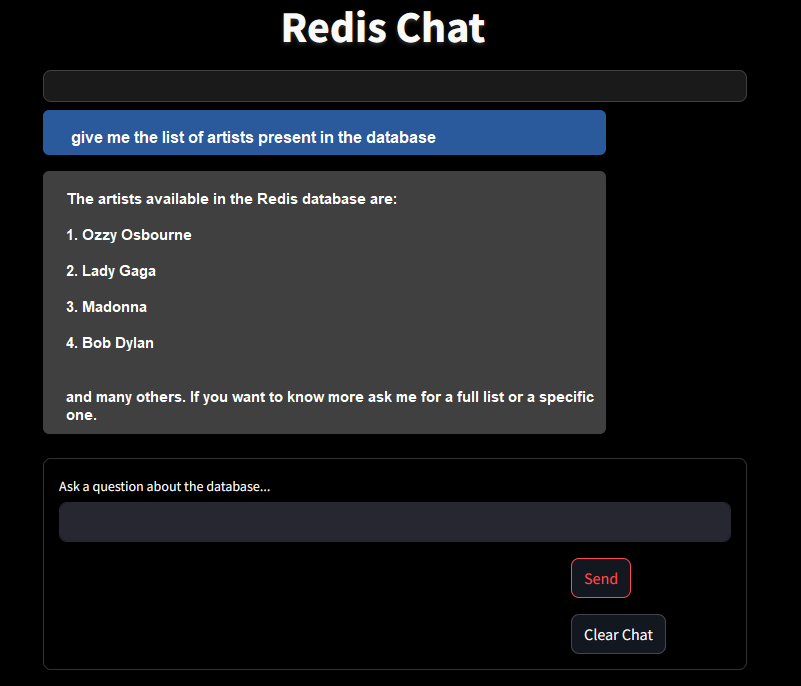

# Chat with Redis
### Connect to your Redis database and query all data using a natural language prompting.


#### Let's see how does it work


**Requirements**

- Python 3.10
- OpenAI key
- Redis database up&runnig


**Install python modules**
```bash
pip install openai redis python-decouple
```


**Configure .env parameters**
```html
API_KEY='ENTER-YOUR-AI-API-KEY-HERE'
DB_HOST='ENTER-YOUR-REDIS-HOST'
DB_PORT='ENTER-YOUR-REDIS-PORT'
DB_PASSWORD='ENTER-YOUR-REDIS-PASSWORD'
```


**Run the code**
```bash
streamlit run app.py
```

